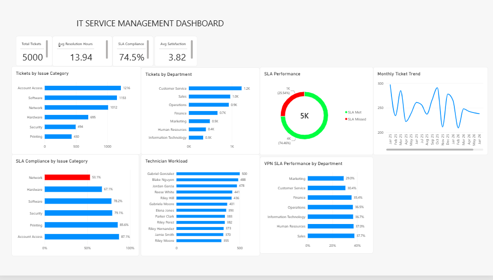

# IT Service Management Analytics

An end-to-end IT service management analytics project using **MySQL, SQL, Power BI, DAX, and business analysis**.

## Project Overview

This project simulates an IT service desk environment for an organization with:

- 500 employees
- 12 IT support technicians
- 7 departments
- 5,000 historical support tickets

The goal was to analyze service desk performance, identify operational bottlenecks, evaluate SLA compliance, and create an interactive management dashboard.

## Tools Used

- MySQL
- MySQL Workbench
- SQL
- Power BI
- DAX
- Data Modeling
- Business Analysis

## Key Performance Indicators

| KPI | Result |
|---|---:|
| Total Tickets | 5,000 |
| Average Resolution Time | 13.94 hours |
| SLA Compliance | 74.5% |
| Average Satisfaction | 3.82 / 5 |

## Key Findings

- Network issues had the lowest SLA compliance at **53.1%**.
- VPN-related incidents showed particularly poor performance across several departments.
- Tickets that met SLA averaged approximately **8.04 hours** to resolve.
- Tickets that missed SLA averaged approximately **31.12 hours** to resolve.
- Average satisfaction was approximately **4.35/5** for tickets meeting SLA.
- Average satisfaction dropped to approximately **2.25/5** when SLA was missed.
- Customer Service generated the highest ticket volume.

## Dashboard Analysis

The Power BI dashboard includes:

- Total ticket volume
- Average resolution time
- SLA compliance
- Average satisfaction
- Tickets by department
- Tickets by issue category
- Monthly ticket trends
- SLA performance
- Technician workload
- SLA compliance by issue category
- VPN SLA performance by department

## Business Recommendations

Based on the analysis:

1. Investigate recurring Network and VPN incidents.
2. Prioritize improvement of Network SLA performance.
3. Review technician workload and ticket assignment practices.
4. Develop troubleshooting documentation for recurring incidents.
5. Monitor SLA performance and satisfaction together.
6. Use monthly ticket trends for staffing and resource planning.

## Database Structure

The MySQL database contains four primary tables:

- `departments`
- `employees`
- `technicians`
- `support_tickets`

Relationships were created using primary and foreign keys to support service desk analysis.

## Skills Demonstrated

- Relational database design
- SQL joins and aggregations
- Data analysis
- KPI development
- Power BI dashboard development
- DAX
- Data modeling
- Requirements analysis
- Business process analysis
- Data-driven recommendations

## Project Purpose

This portfolio project demonstrates how SQL, data visualization, and business analysis can be combined to investigate IT service operations and communicate actionable findings to management.

## Power BI Dashboard

> **Note:** This project uses simulated data created for portfolio and educational purposes.
